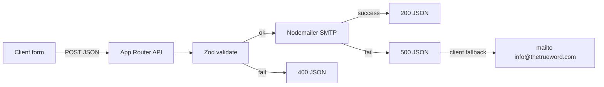

# Next.js 14 Migration — The True Word

## Decisions locked

- **Location:** In-place in `C:\Users\Ransford\Documents\Ocean Cyber\True World` (HTML archived then removed from the live app tree).
- **Forms:** Next.js Route Handlers that send email via SMTP; client falls back to `mailto:info@thetrueword.com` if the API fails (same pattern as today’s coaching modal).

## Target stack

- Next.js **14** App Router + React 18 + TypeScript
- Tailwind CSS (PostCSS, not CDN) + `ttw-gold: #C0A04C`
- Framer Motion for overlay, scroll reveals, modals, page section motion
- `lucide-react` (replaces Lucide CDN)
- `next/font` for Cinzel + Inter
- Nodemailer for outbound mail
- Docker multi-stage image with Next `output: 'standalone'`

## Migration sequence

### 1. Archive legacy and scaffold

- Move current site into `_legacy/` (all `*.html`, `css/`, `js/`, `articles-pages/`, root `.docx`, `ssl-manager.php`) so nothing is lost.
- Scaffold Next.js 14 + TS + Tailwind + ESLint at the repo root (`create-next-app` with App Router).
- Copy `_legacy/images/` → `public/images/` (keep filenames including `logo.png.png`).
- Add `.gitignore`, `.env.example`, `README.md`.

### 2. Design system and app shell

- Port brand tokens from `[js/tailwind-config.js](js/tailwind-config.js)` and `[css/main.css](css/main.css)` into `tailwind.config.ts` + `app/globals.css` (gold, Cinzel utility, nav/hero backgrounds, dark base).
- Keep only the CSS that still matters as globals or small module styles (`course`, `coaching-modal`, FAQ) — drop CDN/noscript paths.
- Build shared layout in `[app/layout.tsx](app/layout.tsx)`: fonts, metadata, `Header`, `Footer`, theme provider (light/dark via `localStorage`, port of `[js/theme.js](js/theme.js)`).
- Single nav using Next `<Link>` (unify the two HTML nav styles into one premium header).

### 3. Routes (1:1 with current pages)

| Old                     | New                            |
| ----------------------- | ------------------------------ |
| `index.html`            | `app/page.tsx`                 |
| `about.html`            | `app/about/page.tsx`           |
| `journey.html`          | `app/journey/page.tsx`         |
| `coaching.html`         | `app/coaching/page.tsx`        |
| `testimonials.html`     | `app/testimonials/page.tsx`    |
| `articles.html`         | `app/articles/page.tsx`        |
| `articles-pages/*.html` | `app/articles/[slug]/page.tsx` |
| `resources.html`        | `app/resources/page.tsx`       |
| `prayer-requests.html`  | `app/prayer-requests/page.tsx` |
| `contact.html`          | `app/contact/page.tsx`         |
| `get-in-touch.html`     | `app/get-in-touch/page.tsx`    |
| `faq.html`              | `app/faq/page.tsx`             |

Home sections (welcome overlay, hero, daily truth, journey/coaching previews, ask-a-question, featured articles) become React components under `components/home/` and `components/` (CourseCards, CoachingPackages, CoachingModal, FaqAccordion, etc.).

### 4. Articles content model

- Extract each of the ~44 articles into `content/articles/<slug>.mdx` (title, description, image, body).
- Registry helper `lib/articles.ts`: `getAllArticles()`, `getArticle(slug)`, `generateStaticParams`.
- Articles index and featured cards read from that registry (no duplicated HTML cards).
- Slugs match current filenames (e.g. `mindset`, `beyond-the-icewall`) so URLs are `/articles/mindset`.

### 5. Client behavior → React + Framer Motion

- Welcome overlay, scroll fade-ins, modal open/close → Framer Motion.
- Course progress, theme, FAQ search → client hooks + `localStorage` (ports of `[course.js](js/course.js)`, `[theme.js](js/theme.js)`, `[faq-enhanced.js](js/faq-enhanced.js)`).
- Daily truth → small client component (port of `[daily-truth.js](js/daily-truth.js)`).
- Reading progress / back-to-top as shared client utilities.

### 6. Email API routes (choice 2A)

- Shared `lib/email.ts` (Nodemailer; SMTP from env).
- Routes:
  - `POST /api/coaching-contact`
  - `POST /api/contact` (get-in-touch + ask-question)
  - `POST /api/prayer`
  - `POST /api/subscribe`
- Zod validation on each body; return JSON `{ ok: true }` / errors.
- Env: `SMTP_HOST`, `SMTP_PORT`, `SMTP_USER`, `SMTP_PASS`, `MAIL_TO` (default `info@thetrueword.com`), `MAIL_FROM`.
- Client forms: `fetch` API first; on network/5xx failure open `mailto:` with prefilled subject/body (coaching already does this).

### 7. Docker

- `next.config.mjs`: `output: 'standalone'`.
- Multi-stage `Dockerfile`: deps → build → runner (`node:20-alpine`, non-root, `PORT=3000`).
- `docker-compose.yml`: `web` service, port `3000`, `.env` for SMTP.
- `.dockerignore`: `_legacy`, `node_modules`, `.next`, docs.

### 8. Cleanup and verify

- After pages/APIs work: leave `_legacy/` until you’re happy, then delete when confirmed (or keep as archive).
- Manual check: all nav links, article SSG, forms with/without SMTP, dark mode, mobile menu, Docker build/run.

## Key files to create

- `app/layout.tsx`, `app/page.tsx`, route `page.tsx` files above
- `components/layout/Header.tsx`, `Footer.tsx`
- `lib/email.ts`, `lib/articles.ts`
- `content/articles/*.mdx`
- `Dockerfile`, `docker-compose.yml`, `.env.example`

## Out of scope

- CMS / admin for articles
- Auth
- Keeping `ssl-manager.php` in the Next deploy (stays in `_legacy` only)
- Migrating `.docx` drafts into the app (archive only)

